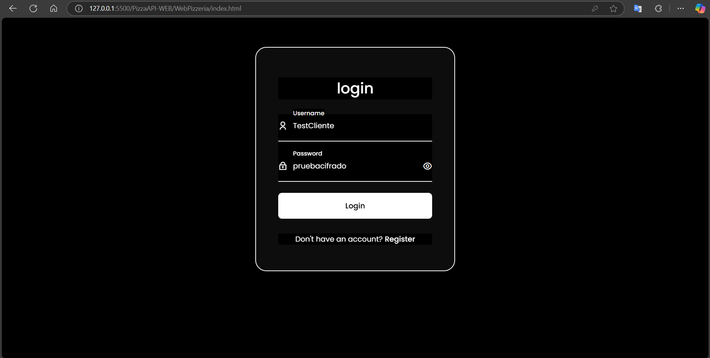
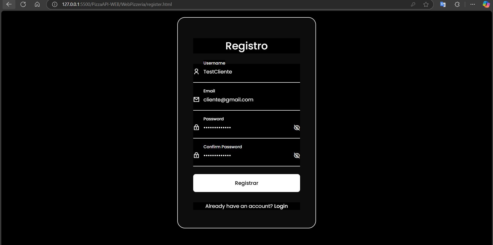
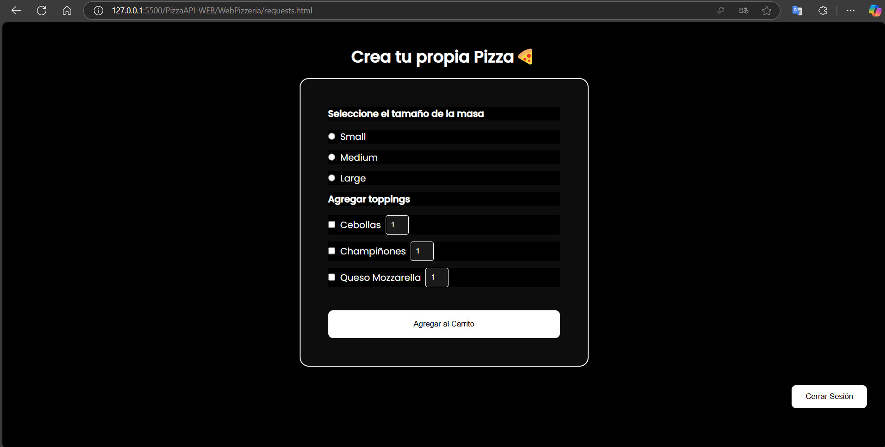
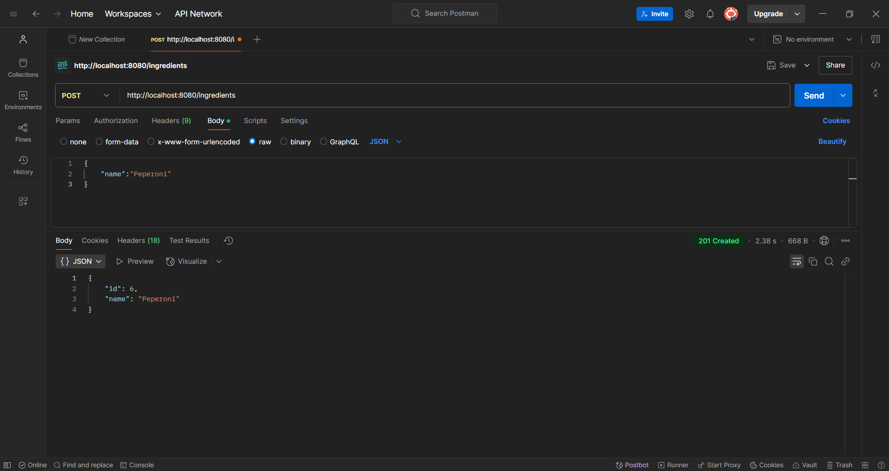
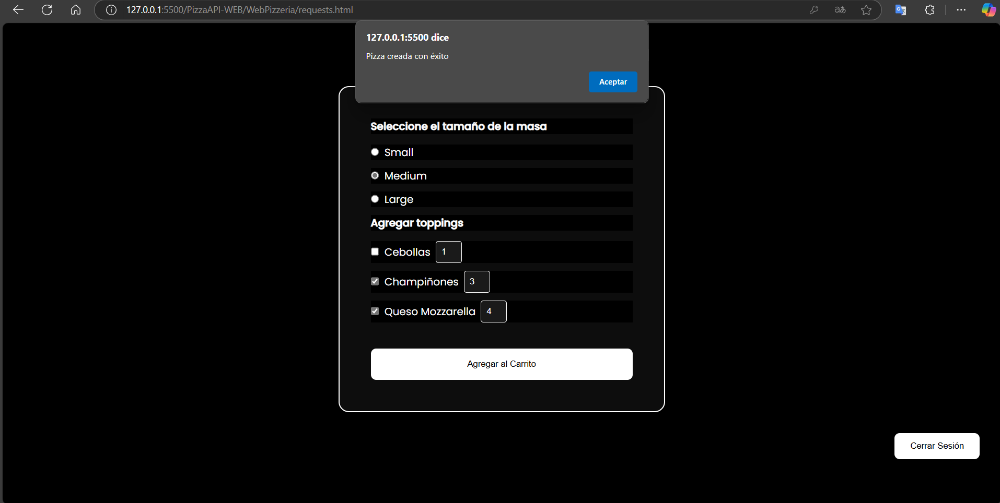
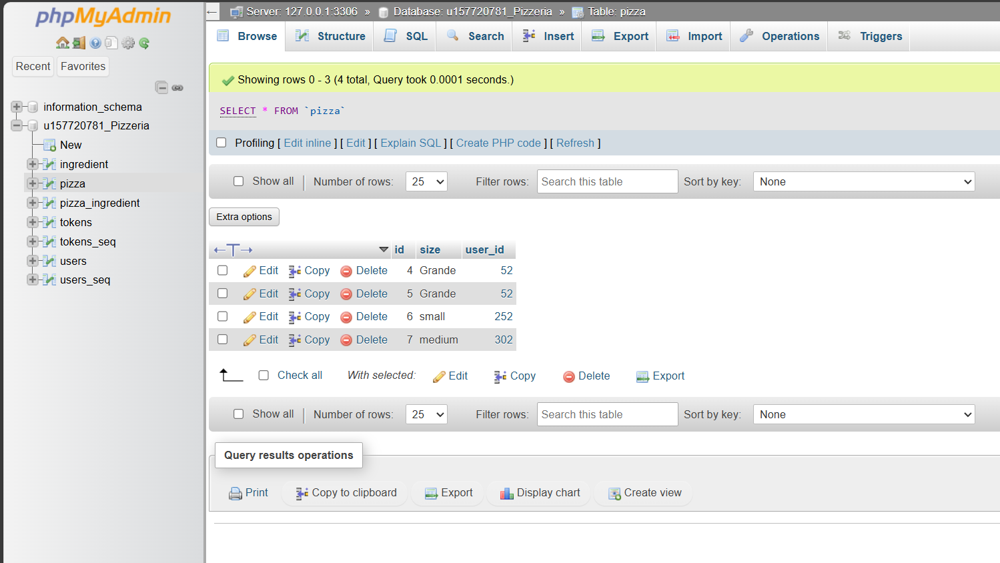

# PizzaAPI-WEB

🍕 Aplicación de Pedido de Pizzas Personalizadas 🍕
Este proyecto es una aplicación web que permite a los usuarios crear y personalizar pizzas con diferentes tamaños y toppings. La aplicación incluye autenticación segura con JWT, una API en Spring Boot y un frontend dinámico con JavaScript.

🚀 Tecnologías utilizadas
Backend

- Spring Boot: Framework para el desarrollo del backend.
- Spring Security + JWT: Implementación de autenticación basada en tokens.
- Spring Data JPA + Hibernate: Gestión de la base de datos.
- MySql: Base de datos en memoria o persistente.
Frontend

- HTML, CSS y JavaScript: Interfaz de usuario interactiva.
- Fetch API: Comunicación con el backend.
- LocalStorage: Almacenamiento de tokens para autenticación.

🔐 Autenticación
Los usuarios deben registrarse e iniciar sesión para crear pizzas. El backend valida los tokens JWT y permite gestionar sesiones seguras.

📌 Funcionalidades
✔️ Registro e inicio de sesión con autenticación JWT.
✔️ Creación y personalización de pizzas (selección de tamaño y toppings).
✔️ Modiicacion de topings para las pizzas (CRUD completo)
✔️ Gestión de pedidos por usuario.
✔️ Seguridad con protección de rutas.
✔️ Persistencia de datos con JPA.

🛠 Cómo ejecutar el proyecto
Backend

- Clona el repositorio

🚧IMPORTANTE🚧

Configura la base de datos en application.properties local o remota.

Ejecuta la aplicación

Frontend

Abre index.html en un servidor local o ejecuta con Live Server en VSCode.

CAPTURAS 📷

Login

Registro

Index

Prueba api Ingredientes

Prueba Creacion

